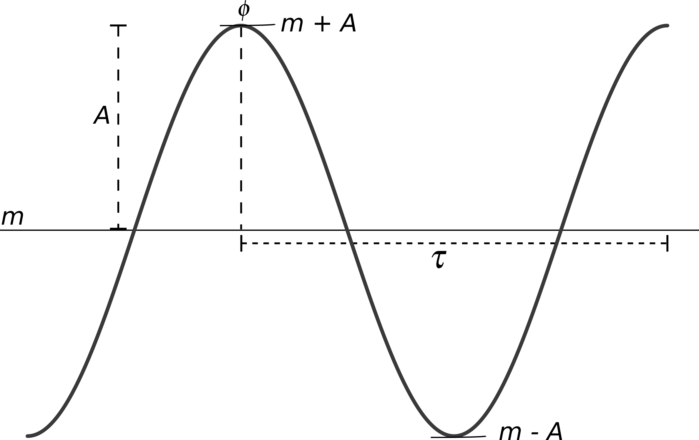

```{r setup, include=FALSE}
library(learnr)
knitr::opts_chunk$set(echo = FALSE, warning = FALSE)
library(tidyr)
library(dplyr)
library(gridExtra)
library(ggplot2)
theme_set(theme_bw())
options(shiny.port=2123, tutorial.exercise.timelimit=180)
```


## Circadian data
***
<br>

> Circadian data is typically a series of observations in time (**timeseries**)


{width=400px}

$A$ = (absolute) amplitude  

$m$ = magnitude  

$\tau$ = intrinsic period  

$\phi$ = phase  

$a = \frac{A}{m}$ = relative amplitude: amplitude as a fraction of the magnitude

$f = \frac{1 + a}{1-a} = \frac{m + A}{m - A}$ = fold-amplitude = ratio of peak to trough values<br/>

### Ex. 1
*Calculate relative amplitude and fold-amplitude and then do the same after changing $m$ from 12 to 24*

*Check that you get the same values for from two ways of calculating $f$*
```{r rhy_params, exercise=TRUE, exercise.lines=8}
A <- 6
m <- 12

```

```{r rhy_params-hint}
a <- A/m
f <- (1+a)/(1-a)
a
f
```


The true scale (*left*) provides the absolute amplitude, while the normalized scale (*right*) provides the relative amplitude and fold-amplitude.

```{r plot_sine, eval=TRUE, fig.height=3}
A <- 6
m <- 12
t <- seq(0, 24, by = 0.5)
df <- data.frame(t, s = m + A*sin(2*pi*t/24))
f1 <- ggplot(df) + geom_line(aes(x=t, y = s)) + theme_bw() +
  labs(title = "Actual scale", x = "time", y="") 
a <- A/m
df <- data.frame(t, s = 1 + a*sin(2*pi*t/24))
f2 <- ggplot(df) + geom_line(aes(x=t, y = s)) + theme_bw() +
  labs(title = "Normalized scale", x = "time", y="")
grid.arrange(f1, f2, nrow=1)
```

## Waveforms
***
<br>

> Rhythmicity only requires a repeating pattern approx. every 24h.

In reality, many shapes are possible  

{width=500px}

>The sinusoidal shape is only for mathematical convenience.

## Analysis goals
***
<br>
**Why** do we do want to perform this analysis?

1. decide if the timeseries is rhythmic or not 

2. if rhythmic, compute the rhythm parameters ($A, a, m, \tau$)<br/> <br/>


> The ability to do this is greatly affected by the *experimental design* (more on this later)

## Sampling scheme
***
<br><br>
{width=600px}
<br><br><br>

Many common techniques, such as qPCR and western blots, can yield either type of data!
<br>

## Genomic data
***
<br>

Let us begin with an example of *preprocessed* microarray data from the mouse liver (@hughes_harmonics_2009). The data were collected in constant dark over 48h, one sample every hour. Mice were sacrified to obtain a sample -- so we have an **independent sampling** scheme.

```{r hughes_intro-setup, eval=TRUE, include=FALSE}
data("cycMouseLiverRNA", package = "MetaCycle")
hughes_data <- gather(cycMouseLiverRNA, time ,expr, -geneName)
hughes_data$time <- as.numeric(gsub("CT","",hughes_data$time))
```
### Ex. 2
*View the dataset*
```{r hughes_intro, exercise = TRUE, fig.height=3, exercise.lines = 2}
cycMouseLiverRNA
```
### Ex. 3
*Plot a few of your favorite clock genes (probe names are in the leftmost column of the data)*
```{r hughes_plot1, exercise=TRUE, exercise.setup="hughes_intro-setup", fig.height=3, exercise.lines=2}

```

```{r hughes_plot1-hint, exercise.eval=FALSE}
qplot(time, expr, data=filter(hughes_data, geneName == "Per2_1417602_at"), xlab = "time (h)", ylab = "expression")
```

### Ex. 4

> It is usual to plot gene expression data in the **log<sub>2</sub>** scale. 

*Can you plot the same clock gene in the log scale?*

```{r hughes_plot2, exercise=TRUE, exercise.setup="hughes_intro-setup", fig.height=3, exercise.lines=2}

```

```{r hughes_plot2-hint, exercise.eval=FALSE}
qplot(time, log2(expr), data=filter(hughes_data, geneName == "Per2_1417602_at"), xlab = "time (h)", ylab = "log2 expression")
```

## Harmonic Regression
***
> We are going to first discuss detection of rhythms only. Estimation of amplitude and phase will come later.

The is the simplest approach to rhythm analysis. A cosine curve is fit to the timeseries ($y$)

$$ y(t) = m + A\cos\left(\frac{2\pi t}{\tau} - \phi\right)$$ Do you recognise the different parameters from [earlier](#circadian-data)?


The above equation is exactly the same as this one:  

$$ y(t) = m + c_1 \cos\left(\frac{2\pi t}{\tau}\right) + c_2 \sin\left(\frac{2\pi t}{\tau}\right)$$  

If you can confidently fix $\tau$, for e.g., $\tau = 24$ for mice or $\tau = 22.5$ for *N. crassa*, then this becomes a least-squares fitting exercise. You might be more familiar with this as linear regression or fitting a straight line through a cloud of points.  

Since a model (the sine curve) is fit to the data is termed a **parametric** approach in statistics.  

Advantages | |Disadvantages
-----------|-|-------------
Regression is very very fast | | Assumes rhythms of interest have sine waveform (recall this [topic](#circadian-data))
Works for many different types of data (independent and longitudinal sampling) | | The noise in your data must be Gaussian and independent between samples. Outliers really can mess things up. | | Assumes period $\tau$ is known and you do not care of small deviations in the period.
Unevenly-spaced or missing samples are not a problem | | 
Amplitude and phase estimates are directly available | | 
Easily used within standard tools for differential gene expression analysis, such as `limma/edgeR` and `DESeq2` | | 
Very flexible. So other trends in data can be included| | 

### Ex. 5

*Let us look at the same liver dataset from before.*
*View the first few lines of the dataset using `head` command*
```{r hughes_data, exercise=TRUE, exercise.lines=8}

```

```{r hughes_data-solution, exercise.eval=FALSE}
# To see the list of datasets in this package
# data(package="analyzeRhythmsdata")

# Load the dataset
data("hughes_2009_liver", package = "analyzeRhythmsdata")

# View the first few rows of the dataset
head(hughes_2009_liver)
```

### Ex. 6

```{r hughes_harmonic-setup, eval=TRUE, include=FALSE}
library(HarmonicRegression)
data("hughes_2009_liver", package = "analyzeRhythmsdata")
```
*Use the `harmonic.regression()` in the package `HarmonicRegression` for rhythm analysis. Run the analysis on the @hughes_harmonics_2009 data and store the results in the 'results' variable*

*View the contents of the results. It includes amplitudes, phases and p-values*
```{r hughes_harmonic, exercise=TRUE}

```

```{r hughes_harmonic-hint-1}
## Step 1. Load the data (already did in the previous first exercise)

## Step 2. Make the data into a matrix of numbers. Move gene names to rownames/columnnames as the case may be.

## Step 3. Transpose the data (genes in columns and times in rows) as `harmonic.regression` needs this format.

## Step 4. Create a vector of time points to match samples to times (this information is in the column names of the original data)

## Step 5. Run the analysis with the required parameters.

## Step 6. View the results
```

```{r hughes_harmonic-hint-2}
## Step 1. Load the data (already did in the previous first exercise)

## Step 2. Make the data into a matrix of numbers. Move gene names to rownames/columnnames as the case may be.

hughes_data <- as.matrix(hughes_2009_liver[-1]) ## drop the gene symbols in the first column)
rownames(hughes_data) <- hughes_2009_liver$GeneName ## matrix in R can have rownames and columnnames

## Step 3. Transpose the data (genes in columns and times in rows) as `harmonic.regression` needs this format.

hughes_data <- t(hughes_data) ## t() is a transpose operator

## Step 4. Create a vector of time points to match samples to times (this information is in the column names of the original data)

times <- seq(1,48) # create a vector of sample times

## Step 5. Run the analysis with the required parameters.

results <- harmonic.regression(inputts = hughes_data, 
                               inputtime = times, 
                               Tau = 24, 
                               normalize = TRUE)

## Step 6. View the results

ls.str(results) # the same information is available from the help for the function, i.e., type ?harmonic.regression
```

The important information in this list are `pars` (contains amplitudes and phase), `pvals` (p-values) and `qvals` (q-values).

## P-values & Q-values
***
<br>

We need to correct for multiple-testing. 

Multiple testing drives the number of false positives up and must be controlled. 

The multiple tests are the large number of transcripts we are testing the genome-wide dataset.

Normally, we correct the p-values for multiple testing to obtain **q-values** or **adjusted p-values** (there are some statistical differences between the two but for your purposes they are the same.)

### Ex. 7

*We have generate matrix of random (normally distributed) values, i.e., there are no rhythms in this data.*

*First, run the code to perform harmonic regression*

*Then, find the number of timeseries with p-value < 0.05*

*Finally, find the number of timeseries with adjusted p-value/q-value < 0.05. What do you see?*

```{r noise_data-setup, eval=TRUE}
library(HarmonicRegression)
data <- matrix(rnorm(48*1000), ncol=48)
```

```{r noise_data, exercise=TRUE}
## View the random data if you like
# head(data)
## Show the dimension of the data (rows columns)
sprintf("The size of the dataset: %d", dim(data))

## Run harmonic regression on the dataset
results <- harmonic.regression(t(data), 
                               inputtime = seq(1,48),
                               Tau = 24,
                               normalize = TRUE)
```

```{r noise_data-hint-1}
## The number of "genes" with p-values less than 0.05
sum(results$pvals < 0.05)
```

```{r noise_data-hint-2}
## Correcting for multiple-testing using Benjamini-Hochberg using `p.adjust`
## but harmonic regression already does this for you
sum(results$qvals < 0.05)
```

**Note** The fraction of "rhythmic" timeseries found by the analysis is approximately `1000 * 0.05`  
<br>

```{r noise_p_dist, eval=TRUE, fig.width=6}
library(HarmonicRegression)
data <- matrix(rnorm(48*1000), ncol=48)
results <- harmonic.regression(t(data), 
                               inputtime = seq(1,48),
                               Tau = 24,
                               normalize = TRUE)

qplot(x = results$pvals, geom = "histogram", bins=50) + xlab("p-values") + ylab("") + ggtitle("Data with no rhythms")
```

On the other hand the p-value distribution on the real data we analyzed earlier, looks like
```{r hughes_p_dist, eval=TRUE, fig.width=6}
library(HarmonicRegression)
data("hughes_2009_liver", package = "analyzeRhythmsdata")

hughes_data <- as.matrix(hughes_2009_liver[-1]) 
times <- seq(1,48)

results <- harmonic.regression(inputts = t(hughes_data), 
                               inputtime = times, 
                               Tau = 24, 
                               normalize = TRUE)

qplot(x = results$pvals, geom = "histogram", bins=50) + xlab("p-values") + ylab("") + ggtitle("Hughes et al. (2009) data")
```

To learn about interpreting p-value distributions read [this post](http://varianceexplained.org/statistics/interpreting-pvalue-histogram/). **Note** these insights are only for the p-value distribution not for the q-values.

> In summary, if you *do not* see a p-value distribution that is flat except for a peak at the left end (near zero), then something is not okay with analysis/method


## Non-parametric approaches
***
<br>

Two popular (and similar) approaches in this category are `JTKcycle` (@hughes_jtk_cycle:_2010) and `rain` (@thaben_detecting_2014).

Both these methods relax the assumption about the strictly sinusoidal shape of the rhythms. More importantly, they only look for patterns of alternating increasing and decreasing values. So scale of the data (normal or log scale) does not matter. 

### JTKcycle

Advantages | | Disadvantages
-----------|-|--------------
Robust to outliers | | Requires integer-intervals and even spacing between samples 
High computational efficiency | | Dispersed output parameters (P-value, period and phase) for low resolution data
Improved power in analyzing data with duplicate samples | | Cosine curve bias
Works with missing data and replicates | | False negative rate issue for low resolution timeseries
Does not assume specific noise distribution | | Less accurate phase for low resolution timeseries
Can test for a range of periods ($\tau$) | |

### Ex. 8

*Apply JTKcycle on the @hughes_harmonics_2009 dataset*

*View the results and the top 10 rhythmic genes*
```{r JTKcycle_run-setup, eval=TRUE}
library(MetaCycle)
data("hughes_2009_liver", package = "analyzeRhythmsdata")
```

```{r JTKcycle_run, exercise=TRUE}
## Step 1. Load the data (already done).

## Step 2: Vector of sample times
times <- seq(1,48)

## Step 3: Run meta2d (that has three methods JTKcycle, Lomb-Scargle and ARSER). The call is complex as it was originally only designed to work with files.
results <- meta2d(inDF = hughes_2009_liver,
                  timepoints = times,
                  minper = 24,
                  maxper= 24,
                  cycMethod = "JTK",
                  outputFile = FALSE,
                  infile = "csv",
                  outdir ="csv", 
                  filestyle = "csv",
                  releaseNote = FALSE)

```

```{r JTKcycle_run-hint-1}
## Step 4: View results -- the data is a list for each method chosen in the meta2d call. Here we are only looking at the JTK results
head(results$JTK)
```

```{r JTKcycle_run-hint-2}
## Step 5: View the top 10 hits
head(results$JTK[order(results$JTK$ADJ.P),], n = 10)
```

### RAIN

Advantages | | Disadvantages
-----------|-|--------------
Unequal length of increasing and decreasing portions of the curve (removes any cosine curve bias)     | | Can be slow for long timeseries
All advantages of JTKcycle  | | Underpowered for short timeseries as bootstrapping provides clustered p-values
P-values are estimated using bootstrapping  |    |    Clustered distribution of p-values can affect multiple-testing correction method
Does not require integer-intervals between samples |  | 

### Ex. 9

```{r rain_run-setup, eval=TRUE}
library(rain)
data(menetRNASeqMouseLiver, package="rain")
```

```{r rain_run, exercise=TRUE,warning=FALSE,message=FALSE}
## Step 1: Load the data
data(menetRNASeqMouseLiver, package="rain")

head(menetRNASeqMouseLiver)
```

```{r rain_run-hint-1}
## Step 2 & 3: Transpose the data and run `rain` on the data
menet.ossc <- rain(t( menetRNASeqMouseLiver ), 
                   deltat = 4, 
                   period = 24,
                   nr.series = 2, 
                   peak.border = c(0.3, 0.7))

```

```{r rain_run-hint-2}
## Step 4: View the results
head(menet.ossc)

```

```{r rain_run-hint-3}
## Step 5: Correct p-values for multiple testing using Benjamini-Hochberg
menet.ossc <- transform(adjusted.pVal = p.adjust(pVal, method = "BH"))

head(menet.ossc)
```

> Please do **not** use phase estimates from `rain`. We will come to parameter estimation next.

> Both methods can only be applied on longitudinal timeseries from a single biological unit timeseries.

## Parameter estimation
***
<br>

The three tests discussed are used to detect rhythms (recall [slide](#analysis-goals)). The standard approach is to follow detection by Harmonic Regression on the timeseries to obtain amplitudes and phases.  

Both detection and estimation are done together in the parametric Harmonic regression. But the non-parametric methods are performed in two steps.   

The `MetaCycle` that contains the JTKcycle method performs these two steps and provides amplitude and phase estimates in the results. On the other hand, `rain` must be followed by `harmonic.regression` to get the amplitudes and phases.  

**Note** `harmonic.regression` gives the relative and *not* the absolute amplitudes.  

> It is common to follow a q-value-based selection of rhythmic timeseries by a relative amplitude-based filtering.

The thinking behind this is as follows. The p-value provides a statistical measure of rhythmicity of a timeseries. It is not uncommon at all to find timeseries that have a very small amplitudes yet have very significant rhythms.  

Such timeseries are statistically but *not biologically* significant. Therefore, we filter the rhythmic timeseries by ensuring that the relative-amplitude is greater than threshold (10%-15%).  

> So statistics are important. But don't get obsessed by the p-values/q-values. Biological relevance is equally important.


## Experimental design
***
<br>

As mentioned earlier, the ability to detect rhythms is extremely sensitive to the sampling of the timeseries.

> For the very good rhythm detection, the current consensus is sampling every 2h over two circadian cycles. 

> For estimating phases and amplitudes, higher sampling is preferred. Accuracy of phase is about half the sampling interval.

For more information on this I refer you to the series of papers on this topic from the Hogenesch group (@wu_evaluation_2014, @li_considerations_2015, @hughes_guidelines_2017)


## Workflow
***
<br>

Step 1. Organize your data in your computer or get public datasets from repositories (such as GEO using `GEOquery` package).

Step 2. Preprocess the data to a matrix of values. E.g., using `oligo` or `affy` packages for microsarray and alignment and counting using `Rsubread`.  

Step 3. Normalize the data according to the technology for inter-sample variation  

Step 4. Exploratory analysis to check for batch effects, bad samples etc.  

Step 5. Filtering out lowly-expressed genes based on mean/median expression.  

Step 6. Rhythm analysis for detecting rhythms and estimating parameters.  

Step 7. Select rhythmic genes according q-value and optionally the relative amplitude.  

Step 8. Plot the results, perform GO analysis, ....   


## Smaller datasets
***
<br>

Often experiments in the lab produce smaller number of timeseries. All the discussed methods can also be used on such data.

However, one must bear in mind the disadvantages of the the particular method when you have few time samples/replicates. Also, since one performs fewer tests, one can opt for more conservative multiple-correction procedures, such as Boneferroni.

With very coarse data, the non-parametric methods are better as they make fewer assumptions.

The most statistically powerful method (when all else fails/one should start with this) is **one-way ANOVA** with time as the factor. If this is significant we known that measured quantity is time-dependent **not** that is rhythmic.

## Golden Rules

**1.** Always look at the data. Seeing is believing. If you cannot see the rhythms it is probably not there.

**2.** Include all effects in your analysis, e.g., different batches, different cultures. Check if they matter before ignoring them.

**3.** Think about the analysis before you run experiments. If needed, get in touch with biostatistician/bioinformatician.

**4.** P-value > threshold does not mean the timeseries is not rhythmic, only that the evidence is inconclusive. Absence of evidence is **not** evidence of absence.

**5.** Never duplicate and concatenate data before running statistics (@hughes_guidelines_2017)

**6.** Control for multiple testing (@hughes_guidelines_2017)

**7.** Deposit your raw data into public repositories (@hughes_guidelines_2017)

**8.** Never directly alter the raw data. Always save any processed data separately.

**9.** Never do two tests when you can get away with one -- do differential rhythmicity analysis when you compare two rhythms (@thaben_differential_2016)  

## References and Resources
 Learn programming in R with free [book](https://r4ds.had.co.nz)  |      {width=100px}
 
 [MetaCycle](https://cran.r-project.org/web/packages/MetaCycle/vignettes/implementation.html) package for running three different rhythm analysis tools 
 
 Well-managed repositories for biological data analysis [Bioconductor](https://www.bioconductor.org/). They also have many workflows and tools to make your life easier.
 
 Exploratory analysis and pre-processing (before rhythm analysis) workflows for microarrays (on [bioconductor](https://www.bioconductor.org/packages/release/workflows/vignettes/arrays/inst/doc/arrays.html)) and RNA-seq (@love_rna-seq_2015)
 
 Designing and conducting circadian RNA-seq study (@li_considerations_2015)
 
 [BioDare](https://biodare2.ed.ac.uk/) -- Fast period analysis, timeseries processing and aesthetic visualizations
 

### References
